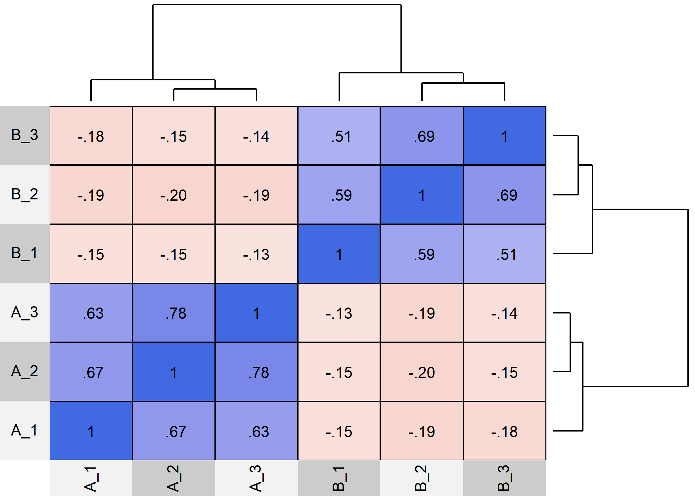

<!-- README.md is generated from README.Rmd. Please edit that file -->

# WJSmisc

<!-- badges: start -->
<!-- badges: end -->

The WJSmisc package is set of functions I find convenient to have
readily available to me.

## Installation

You can install the development version from
[GitHub](https://github.com/) with:

``` r
# install.packages("remotes")
remotes::install_github("wjschne/WJSmisc")
```

## Plot area under normal curve

I often need to create a normal distribution with a shaded region below
a point.

``` r
library(WJSmisc)
plotnorm(95, mu = 100, sigma = 15)
```


# Correlation heat maps

``` r
library(simstandard)
model <- "
A =~ 0.71 * A_1 + 0.91 * A_2 + 0.85 * A_3
B =~ 0.65 * B_1 + 0.90 * B_2 + 0.75 * B_3
A ~~ -0.2 * B
"

d <- sim_standardized(
  model, 
  latent = FALSE, 
  error = FALSE)
cor_heat(d, margins = 0.1)
```



# Composite covariance

``` r
# Create covariance matrix
Sigma <- matrix(0.6, nrow = 5, ncol = 5)
diag(Sigma) <- 1

# Create weight matrix
w <- matrix(0, nrow = 5, ncol = 2)
w[1:2,1] <- 1
w[3:5,2] <- 1
w
#>      [,1] [,2]
#> [1,]    1    0
#> [2,]    1    0
#> [3,]    0    1
#> [4,]    0    1
#> [5,]    0    1

# covariance of weighted sums
composite_covariance(Sigma, w)
#>      [,1] [,2]
#> [1,]  3.2  3.6
#> [2,]  3.6  6.6
```
