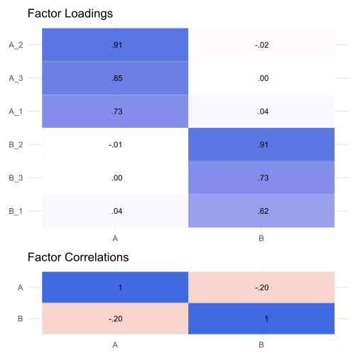

<!-- README.md is generated from README.Rmd. Please edit that file -->

# WJSmisc

<!-- badges: start -->
<!-- badges: end -->

The WJSmisc package is set of functions I find convenient to have
readily available to me.

## Installation

You can install the development version from
[GitHub](https://github.com/) with:

``` r
# install.packages("remotes")
remotes::install_github("wjschne/WJSmisc")
```

## Plot area under normal curve

I often need to create a normal distribution with a shaded region below
a point.

``` r
library(WJSmisc)
library(tidyverse)
plotnorm(95, mu = 100, sigma = 15)
```


# Correlation heat maps

``` r
library(simstandard)
model <- "
A =~ 0.71 * A_1 + 0.91 * A_2 + 0.85 * A_3
B =~ 0.65 * B_1 + 0.90 * B_2 + 0.75 * B_3
A ~~ -0.2 * B
"

d <- sim_standardized(
  model, 
  latent = FALSE, 
  error = FALSE)

cor_heat(d, margins = 0.1)
```


# Parallel Analysis Plot

``` r
parallel_analysis(d)
```


# Factor Analysis Loading Plot

``` r
psych::fa(d, nfactors = 2, fm = "pa") %>% 
  plot_loading(factor_names = c("A", "B"))
```



# Composite covariance

``` r
# Create covariance matrix
Sigma <- matrix(0.6, nrow = 5, ncol = 5)
diag(Sigma) <- 1

# Create weight matrix
w <- matrix(0, nrow = 5, ncol = 2)
w[1:2,1] <- 1
w[3:5,2] <- 1
w
#>      [,1] [,2]
#> [1,]    1    0
#> [2,]    1    0
#> [3,]    0    1
#> [4,]    0    1
#> [5,]    0    1

# covariance of weighted sums
composite_covariance(Sigma, w)
#>      [,1] [,2]
#> [1,]  3.2  3.6
#> [2,]  3.6  6.6
```

# Correlation Ellipse

``` r
cor_ellipse(0.75) %>% 
  ggplot(aes(x,y)) + 
  geom_polygon(alpha = 0.5) + 
  coord_fixed()
```


Split at x = 1

``` r
cor_ellipse(0.75, split_x = 1) %>% 
  ggplot(aes(x,y)) + 
  geom_polygon(aes(fill = group), alpha = 0.5) + 
  coord_fixed()
```


Split at x = 1 and y = 0

``` r
cor_ellipse(0.75, split_x = 1, split_y = 0) %>% 
  ggplot(aes(x,y)) + 
  geom_polygon(aes(fill = group), alpha = 0.5) + 
  coord_fixed()
```


# Every combination of 2 or more vectors

``` r
cross_vectors(c("a", "b"), 
              c("x", "y"),
              c(1,2), 
              sep = "_")
#> [1] "a_x_1" "a_x_2" "a_y_1" "a_y_2" "b_x_1" "b_x_2" "b_y_1" "b_y_2"
```

# z-score

Like the `scale` function except that it returns a plain vector instead
of a matrix with attributes. It can also return z-scores based on a
user-specified means and standard deviations.

``` r
x <- rnorm(100, mean = 100, sd = 15)

# z-score with sample mean and sample sd
x2z(x) %>% 
  qplot(bins = 10) + 
  geom_rug()
```


``` r
# z-score with user-specified population mean and sd
x2z(x, mu = 100, sigma = 15) %>% 
  qplot(bins = 10) + 
  geom_rug()
```


``` r
# Will center score at sample mean if sigma = 1
x2z(x, sigma = 1) %>% 
  qplot(bins = 10) + 
  geom_rug()
```


# Attach function argument defaults to global environment

When debugging a function with many default arguments, it is useful to
assign the default values to the variables in the global environment.

``` r
my_function <- function(x = 1, y = 2) {x + y}
attach_function(my_function)
x
#> [1] 1
y
#> [1] 2
```

# Convert an angle to ggplot2 `hjust` and `vjust` parameters

Control placement of labels with the angular position by converting an
angle to `hjust` and `vjust` parameters.

``` r
tibble(degrees = seq(0, 345, 15),
       radians = degrees * pi / 180,
       x = cos(radians),
       y = sin(radians),
       hjust = angle2hjust(radians),
       vjust = angle2vjust(radians)) %>% 
  ggplot(aes(x, y)) + 
  geom_segment(aes(x = 0, y = 0, xend = x, yend = y), size = .1) +
  geom_label(aes(label = degrees, 
                 hjust = hjust,
                 vjust = vjust),
             label.padding = unit(1, "mm"),
             label.size = 0) + 
  geom_point() + 
  coord_fixed(1, clip = "off") +
  theme_void()
```


I use these functions to make sure that labels on a curve are
perpendicular to the curve:

``` r
# Small change in x
dx <- .000001
plot_ratio <- 16
tibble(x = seq(-4,4), 
       y = dnorm(x), 
       l = WJSmisc::prob_label(pnorm(x), digits = 2),
       slope = plot_ratio * (dnorm(x + dx) - y) / dx,
       angle = atan(slope) + pi / 2,
       hjust = angle2hjust(angle),
       vjust = angle2vjust(angle)) %>% 
ggplot(aes(x, y, label = l)) +
  geom_point() +
  stat_function(fun = dnorm) +
  geom_label(aes(hjust = hjust,
                 vjust = vjust),
             label.size = 0) + 
  coord_fixed(plot_ratio, clip = "off") + 
  theme_minimal()
```


# Lower triangle to correlation matrix

``` r
tri2cor(c(.2,.3,.4))
#>      [,1] [,2] [,3]
#> [1,]  1.0  0.2  0.3
#> [2,]  0.2  1.0  0.4
#> [3,]  0.3  0.4  1.0
tri2cor(.5)
#>      [,1] [,2]
#> [1,]  1.0  0.5
#> [2,]  0.5  1.0
```

# Formatting probability values

Probabilities near 0 and 1 are rounded differently.

``` r
p <- c(0,.0012, .025, .5, .99, .994, .99952, 1)
prob_label(p, digits = 2)
#> [1] "0"     ".0012" ".025"  ".50"   ".99"   ".994"  ".9995" "1"
prob_label(p, accuracy = .01)
#> [1] "0"    ".00"  ".02"  ".50"  ".99"  ".99"  "1.00" "1"

proportion_round(p)
#> [1] 0.0000 0.0010 0.0300 0.5000 0.9900 0.9940 0.9995 1.0000
proportion2percentile(p, add_percent_character = TRUE)
#> [1] "0%"     "0.1%"   "3%"     "50%"    "99%"    "99.4%"  "99.95%" "100%"
```

# Sizing text in ggplot2

Text size in geom_text and geom_label does not use the same units as the
rest of ggplot2.

I use the `ggtext_size` function so that text from `geom_text` will be
the same size as the axis labels.

``` r
mytextsize <- 24
tibble(x = 1:5, y = x) %>% 
  ggplot(aes(x, y)) + 
  geom_text(aes(label = x), size = ggtext_size(mytextsize)) + 
  theme_gray(base_size = mytextsize) +
  coord_equal()
```


# Random beta distributions with specific means and standard deviations.

Sometimes I need random variables with values between 0 and 1. To get a
beta distribution that I want, there is less trial-and-error if I
specify the mean and standard deviation rather than 2 shape parameters.
Note that not all combinations of means and standard deviations are
possible.

``` r
rbeta_ms(10000, .7, .1) %>% 
  qplot(bins = 30) +
  coord_cartesian(xlim = c(0, 1))
```


# Formatting numeric values

R has great formatting functions like `format` and `formatC`. I find
`scales::number` to be particularly useful. However, I often have
particular preferences that I do not want to keep specifying every time
I need to format a number.
